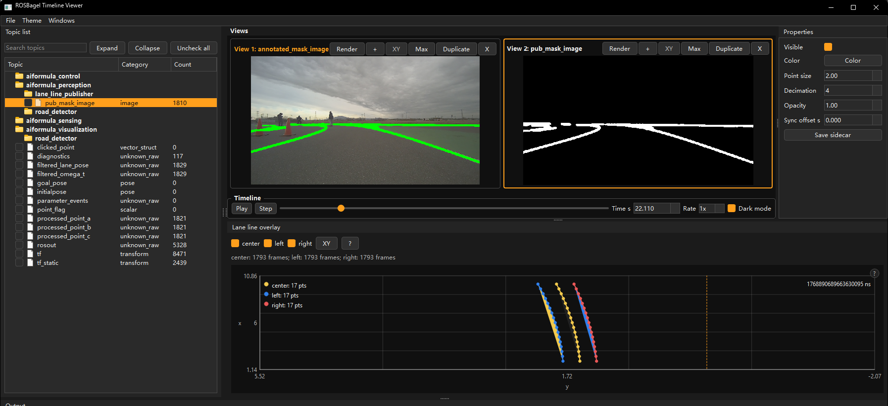
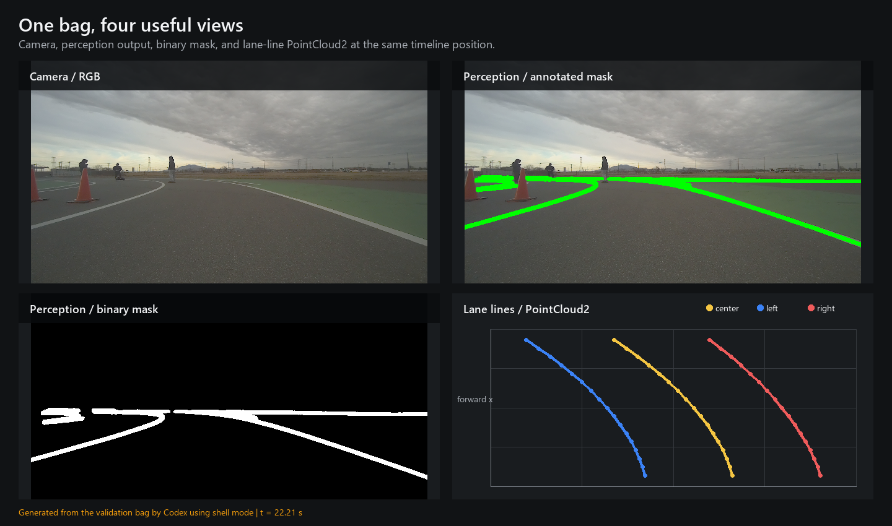
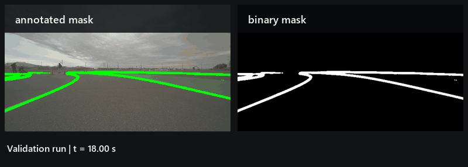

# ROSBagel

[English](README.md) | 简体中文

[](https://github.com/Tsubashimo-Nanato/ROSBagel/releases)

[](LICENSE)


在 Windows 上直接打开 ROS 1/2 bag，检查里面有什么，再导出真正需要的数据，不必先把工作站临时改造成一套 ROS 环境。

`ros2unbag` 是一个离线、只读的 bag 检查与导出工具，提供 CLI、交互式 shell，以及基于 PySide6 的时间线查看器，可用于图像、车道线点云、topic 元数据和同步预览。



> [!NOTE]
> CLI 和导出器已经可以投入实际使用。GUI 仍在积极开发中：交互和渲染会持续改进，欢迎趁那些别扭的边角还容易调整时提交问题。

## 快速开始

```powershell
git clone https://github.com/Tsubashimo-Nanato/ROSBagel.git
cd ROSBagel
py -m pip install -e .[gui]

ros2unbag topics .\my_bag
ros2unbag gui .\my_bag
```

仓库也提供了 Windows 安装脚本：

```bat
install.bat
install.bat gui
```

如果执行 `install.bat` 后终端暂时找不到 `ros2unbag`，请重启终端。

## 能做什么

| 范围 | 实际用途 |
| --- | --- |
| 检查 | Topic 树、详细扫描、消息数量、持续时间、时间戳和最近消息查询 |
| 导出 | CSV、Parquet、SQLite、JSONL、NPZ、原始 CDR、PNG/JPG、MP4、PCD 和 PLY |
| 探索 | 带历史记录、topic 补全和批量导出队列的交互式 shell |
| 可视化 | 时间线拖动、图像播放、分屏、车道线叠加、点云预览和明暗主题 |
| 保持离线 | 通过 `rosbags` 读取 rosbag1/rosbag2；必要时使用 SQLite 读取原始 ROS 2 数据 |

工具不会重写 bag。GUI 设置可以保存在 sidecar JSON 中，无损导出仍由独立的导出器完成。

## 真实 Bag，真实画面

下面的 2x2 图来自本地验证 bag 的同一时间点，包含 RGB 相机、带标注的感知结果、二值 mask，以及三条车道线 `PointCloud2` topic。



同一次验证 run 的动态预览：



如果 GIF 不是你偏好的科学仪器，也可以[打开 MP4 预览](docs/media/validation-run.mp4)。

2x2 图片、GIF 和 MP4 均由 Codex 使用 shell mode 直接从 bag 生成，没有用合成道路场景或手绘车道线替代真实数据。

## 常用命令

启动交互式 shell：

```powershell
ros2unbag
```

一个简短的交互过程如下：

```text
ros2unbag> open .\my_bag
ros2unbag> topics
ros2unbag> scan --all
ros2unbag> inspect --time 22.2 --dur /camera/image_raw
ros2unbag> export /camera/image_raw --format mp4 --fps 30 --out .\export
ros2unbag> export /points --format pcd --out .\export
ros2unbag> gui
```

也可以直接使用对应命令：

```powershell
ros2unbag scan .\my_bag --out .\scan
ros2unbag export .\my_bag --topic /imu --format parquet --out .\export
ros2unbag export .\my_bag --topic /camera/image_raw --format png --out .\export
ros2unbag export .\my_bag --topic /points --format ply --out .\export
ros2unbag export-all .\my_bag --out .\export
```

升级已安装版本：

```powershell
ros2unbag upgrade --yes
```

## 导出说明

- 图像和视频导出支持已解码的 `sensor_msgs/msg/Image` 与 `sensor_msgs/msg/CompressedImage` topic。
- PCD 和 PLY 会保留受支持的 `PointCloud2` 数值字段，例如 `x`、`y`、`z`、`intensity`、`rgb`、`ring` 和 `time`。
- MP4 使用固定 FPS 播放，并将原始 ROS 时间戳写入 sidecar CSV。
- PNG/JPG、点云序列、NPZ 序列、MP4 和 raw 导出会在适用时附带时间戳 sidecar。
- 不支持或无法解码的自定义消息仍可导出为原始序列化数据。

## GUI 开发状态

时间线查看器是面向 Windows 的离线可视化工作区。目前开发重点包括可预测的 topic 分配、分屏、受限大小的图像播放缓存、车道线与点云导航，以及不需要和 dock 窗口摔跤的面板行为。

它有意保持只读：这不是实时 ROS subscriber、recorder、节点图检查器或完整的 RViz2 替代品。可选的 3D 点云渲染还依赖可用的 VisPy/OpenGL 环境；即使该环境不可用，应用的其余部分仍可使用。

直接启动 GUI：

```powershell
ros2unbag gui .\my_bag
```

## 示例数据来源

上述媒体使用的示例 bag 来自一次采用开源 [aiformula-support/aiformula](https://github.com/aiformula-support/aiformula) 技术栈、由 [SophiaControl/AIformula_sophia](https://github.com/SophiaControl/AIformula_sophia) 完成的验证 run。

室外自动驾驶项目的背景资料可参阅 [AI Formula 开发页面](https://sites.google.com/p.chibakoudai.jp/rdc-lab/development/ai-formula)。该 bag 仅作为本地调试数据，不随本仓库分发。

这些链接用于说明数据来源和项目背景，不代表相关组织维护、认可或审计 `ros2unbag`。

## 已知限制

- 图像解码目前覆盖常见的 RGB/BGR/RGBA/BGRA、mono8/16、`16UC1` 和 `32FC1` 编码。
- MP4 codec 可用性取决于 OpenCV 构建和运行平台。
- SQLite fallback 无法反序列化 CDR 消息；需要解码导出时请使用 `rosbags` backend。
- 自定义消息支持取决于 `rosbags` 能否从 bag 元数据获得对应定义。
- 大尺寸、高分辨率图像 topic 在刷新受限播放窗口时可能短暂停顿。
- Bag 可能包含私有相机、传感器、地图或实验室数据，请在发布导出内容前完成检查。

## 开发披露

本项目在实现、重构、测试、文档，以及上文展示的 shell-mode 媒体工作流中使用了大量 AI 辅助。最终集成、审查和发布批准仍由维护者负责；这些审查不构成专业安全审计。

维护者：Owen Zi-Wen ZHOU<br>
所属：Sophia University，Control Engineering / AI Formula

## 参与贡献

欢迎聚焦的问题报告、边界情况说明和小型 pull request。请参阅 [CONTRIBUTING.md](CONTRIBUTING.md)。除非已经完成检查和脱敏，请勿将私有 bag 附加到公开 issue。

## 许可证

`ros2unbag` 使用 `AGPL-3.0-or-later` 许可证，详见 [LICENSE](LICENSE)。
